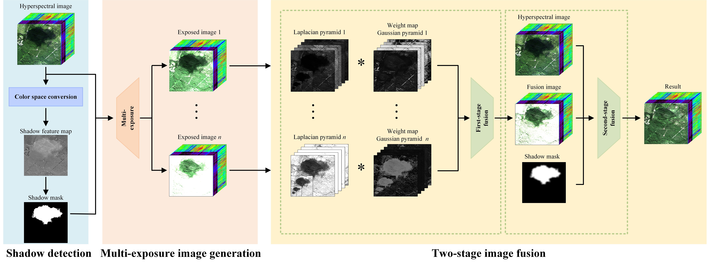

# Shadow Removal of Hyperspectral Remote Sensing Images With Multiexposure Fusion

[Puhong Duan](https://scholar.google.ch/citations?hl=en&user=IYUlx_8AAAAJ&view_op=list_works&sortby=pubdate), [Shangsong Hu](), [Xudong Kang](https://scholar.google.ch/citations?user=5XOeLZYAAAAJ&hl=en), [Shutao Li]()

___________

The code in this toolbox implements the ["Shadow Removal of Hyperspectral Remote Sensing Images With Multiexposure Fusion"](https://ieeexplore.ieee.org/document/9874905). More specifically, it is detailed as follow.

Citation
---------------------

**Please kindly cite the papers if this code is useful and helpful for your research.**

P. Duan, S. Hu, X. Kang and S. Li, "Shadow Removal of Hyperspectral Remote Sensing Images With Multiexposure Fusion," in IEEE Transactions on Geoscience and Remote Sensing, vol. 60, pp. 1-11, 2022, Art no. 5537211, doi: 10.1109/TGRS.2022.3203808.

    @article{Shadow,
      title     = {Shadow Removal of Hyperspectral Remote Sensing Images With Multiexposure Fusion},
      author    = {Duan, Puhong and Hu, Shangsong and Kang, Xudong and Li, Shutao},
      journal   = {IEEE Transactions on Geoscience and Remote Sensing}, 
      year      = {2022},
      volume    = {60},
      number    = {},
      pages     = {1-11},
      doi       = {10.1109/TGRS.2022.3203808},
      publisher = {IEEE},
     }
# Usage
Run demo.m in Matlab
     
# Contact Information

Puhong Duan: puhpng_duan@hnu.edu.cn
